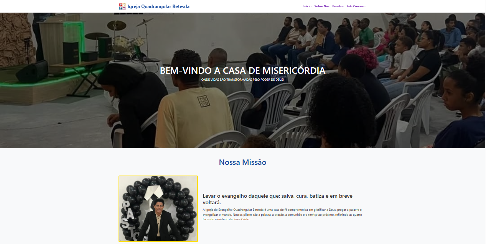
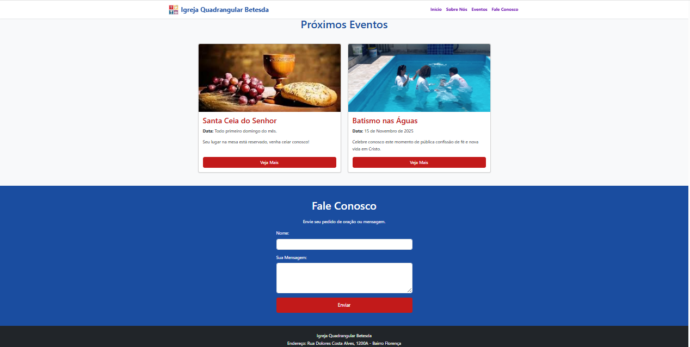
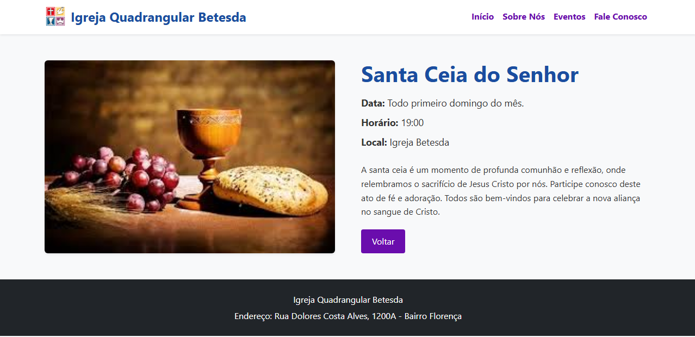
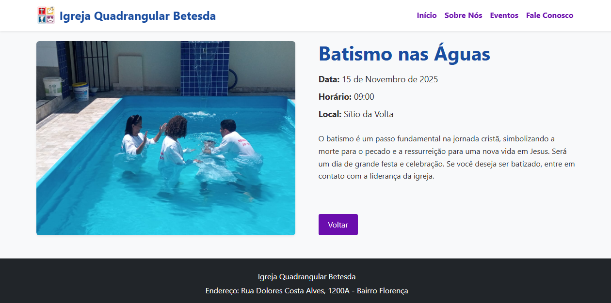

[](https://classroom.github.com/online_ide?assignment_repo_id=20901970&assignment_repo_type=AssignmentRepo)
# Trabalho Prático 05 - Semanas 7 e 8

**Páginas de detalhes dinâmicas**

Nessa etapa, vamos evoluir o trabalho anterior, acrescentando a página de detalhes, conforme o  projeto escolhido. Imagine que a página principal (home-page) mostre um visão dos vários itens que existem no seu site. Ao clicar em um item, você é direcionado pra a página de detalhes. A página de detalhe vai mostrar todas as informações sobre o item do seu projeto. seja esse item uma notícia, filme, receita, lugar turístico ou evento.

Leia o enunciado completo no Canvas. 

**IMPORTANTE:** Assim como informado anteriormente, capriche na etapa pois você vai precisar dessa parte para as próximas semanas. 

**IMPORTANTE:** Você deve trabalhar e alterar apenas arquivos dentro da pasta **`public`,** mantendo os arquivos **`index.html`**, **`styles.css`** e **`app.js`** com estes nomes, conforme enunciado. Deixe todos os demais arquivos e pastas desse repositório inalterados. **PRESTE MUITA ATENÇÃO NISSO.**

## Informações Gerais

- Nome: João Vítor Rodrigues da Silva
- Matricula: 905416
- Proposta de projeto escolhida: Igreja
- Breve descrição sobre seu projeto: Site para a igreja onde eu congrego.

## Print da Home-Page

<<  COLOQUE A IMAGEM AQUI >>



## Print da página de detalhes do item

<<  COLOQUE A IMAGEM AQUI >>



## Cole aqui abaixo a estrutura JSON utilizada no app.js

```javascript
const eventos = [
  {
    id: 1,
    titulo: "Santa Ceia do Senhor",
    data: "Todo primeiro domingo do mês.",
    descricaoLonga: "A santa ceia é um momento de profunda comunhão e reflexão, onde relembramos o sacrifício de Jesus Cristo por nós. Participe conosco deste ato de fé e adoração. Todos são bem-vindos para celebrar a nova aliança no sangue de Cristo.",
    imagem: "img/santaceia.jpg",
    horario: "19:00",
    local: "Igreja Betesda"
  },
  {
    id: 2,
    titulo: "Batismo nas Águas",
    data: "15 de Novembro de 2025",
    descricaoLonga: "O batismo é um passo fundamental na jornada cristã, simbolizando a morte para o pecado e a ressurreição para uma nova vida em Jesus. Será um dia de grande festa e celebração. Se você deseja ser batizado, entre em contato com a liderança da igreja.",
    imagem: "img/batismo.jpg",
    horario: "09:00",
    local: "Sítio da Volta"
  }
];
```